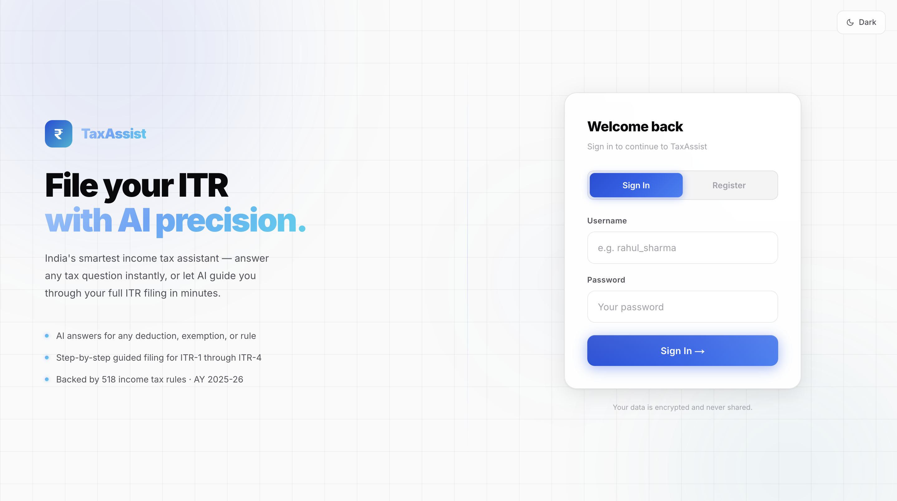

# TaxAssist — AI Income Tax Filing Assistant

An AI-powered Indian Income Tax Return (ITR) filing assistant. Combines a RAG-based Q&A engine (trained on 518 Income Tax Rules + the Income Tax Act 1961) with a guided conversational ITR filing flow supporting ITR-1 through ITR-4 for AY 2025-26.



[Delpoyed Link](tax-assist-drab.vercel.app)

## Features

- **Conversational ITR Filing** — AI guides you step-by-step through the entire ITR filing process (personal info, income sources, deductions, tax computation, bank details, summary)
- **Multi-Form Support** — ITR-1 (salaried), ITR-2 (capital gains), ITR-3 (business/profession), ITR-4 (presumptive income)
- **RAG-Powered Q&A** — Ask anything about the Income Tax Act 1961 or Rules 1962 and get accurate, source-cited answers
- **Hybrid Retrieval** — Combines metadata-filtered exact rule/section lookup with semantic MMR search
- **Old vs New Regime Comparison** — Computes and compares tax liability under both regimes with a recommendation
- **JWT Authentication** — Secure login/register with bcrypt passwords and httpOnly JWT cookies
- **MongoDB Persistence** — All filings and chat history saved to MongoDB Atlas per user
- **Save & Resume** — Auto-saves progress at every step; resume with full chat history restored
- **Light/Dark Mode** — Theme toggle with system-aware default, persisted in localStorage

## Tech Stack

| Layer | Technology |
|-------|-----------|
| Frontend | Next.js (App Router) + TypeScript |
| Backend | FastAPI (Python) |
| LLM | Groq (`openai/gpt-oss-120b`) |
| RAG Framework | LangChain |
| Vector Database | ChromaDB (file-based, committed to git) |
| Embeddings | HuggingFace Inference API (`all-MiniLM-L6-v2`) |
| Database | MongoDB Atlas |
| Authentication | bcrypt + JWT (httpOnly cookies) |
| Data Scraping | BeautifulSoup, Crawl4AI, Playwright |
| Deployment | Vercel (frontend) + Railway (backend) |


## Local Development Setup

### Prerequisites
- Python 3.10+
- Node.js 18+
- A [Groq API key](https://console.groq.com/) (free)
- A [MongoDB Atlas](https://www.mongodb.com/atlas) account (free M0 tier)
- A [HuggingFace](https://huggingface.co/settings/tokens) API token (free, Read access)

### 1. Clone the repository

```bash
git clone https://github.com/your-username/income_tax_assistent.git
cd income_tax_assistent
```

### 2. Backend setup

```bash
cd backend
pip install -r requirements.txt
```

Copy and fill in your environment variables:
```bash
cp .env.example .env
```

Edit `backend/.env`:
```env
GROQ_API_KEY=gsk_your_key_here
MONGO_URI=<your-mongodb-atlas-connection-string>
MONGO_DB_NAME=income_tax
JWT_SECRET=run_python_-c_"import secrets; print(secrets.token_hex(32))"
ALLOWED_ORIGIN=http://localhost:3002
HF_API_TOKEN=hf_your_token_here
```

Start the backend:
```bash
uvicorn main:app --reload --port 8001
# Runs at http://localhost:8001
# Check: http://localhost:8001/health → {"status":"ok","rag_ready":true}
```

### 3. Frontend setup

```bash
cd frontend
npm install
npm run dev -- --port 3002
# Runs at http://localhost:3002
```

The Next.js dev server automatically proxies `/api/*` → `localhost:8001`, so no CORS issues locally.

### 4. Open the app

Go to `http://localhost:3002`, register an account, and start filing.

---


## API Reference

### Auth
| Method | Endpoint | Description |
|--------|----------|-------------|
| POST | `/api/auth/register` | Create account, sets JWT cookie |
| POST | `/api/auth/login` | Login, sets JWT cookie |
| POST | `/api/auth/logout` | Clears JWT cookie |
| GET | `/api/auth/me` | Returns current user |

### Filings
| Method | Endpoint | Description |
|--------|----------|-------------|
| GET | `/api/filings` | List all user's filings |
| POST | `/api/filings` | Save new filing |
| GET | `/api/filings/{id}` | Load filing + chat history |
| PATCH | `/api/filings/{id}` | Update filing |
| DELETE | `/api/filings/{id}` | Delete filing |

### Streaming (SSE)
| Method | Endpoint | Description |
|--------|----------|-------------|
| GET | `/api/qa/stream?q=...` | Stream Q&A answer |
| POST | `/api/filing/message/stream` | Stream filing step response |
| POST | `/api/filing/welcome` | Stream welcome message for new filing |

---

## Environment Variables

### Backend
| Variable | Required | Description |
|----------|----------|-------------|
| `GROQ_API_KEY` | Yes | From [Groq Console](https://console.groq.com/) |
| `MONGO_URI` | Yes | MongoDB Atlas `mongodb+srv://` connection string |
| `MONGO_DB_NAME` | No | Database name (default: `income_tax`) |
| `JWT_SECRET` | Yes | Random 32-byte hex string for signing JWT tokens |
| `ALLOWED_ORIGIN` | Yes | Frontend URL for CORS (e.g. `https://taxassist.vercel.app`) |
| `HF_API_TOKEN` | Yes | HuggingFace Read token for embedding API |

### Frontend
| Variable | Required | Description |
|----------|----------|-------------|
| `NEXT_PUBLIC_API_URL` | Production only | Railway backend URL |
